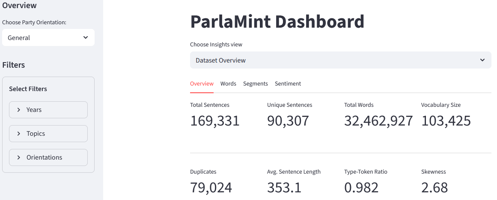

# ParlaMint Data Dashboard

This is a work-in-progress Streamlit dashboard for getting a better view of the [ParlaMint](https://clarin.eu/parlamint) dataset. Only to help explore dataset more easily. Currently uses only the Italian-English ParlaMint dataset.

## Quick snapshot:

## TODO

- [x] Add filtering by country, party, and time period
- [x] Include basic NLP metrics (word frequency, lexical diversity, skewness, etc.)
- [x] Improve visualization layouts and performance

### Future ideas

- [ ] Add more filters (e.g., speaker, date)
- [ ] Integrate data from additional countries
